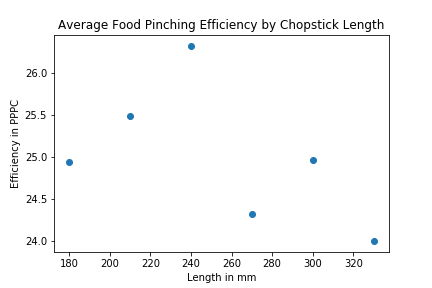

# Data-Analyst-NanoDegree-Udacity
A collection of my projects for Udacity Data Analyst Nanodegree
## Project 1: Chopstick Length Analysis
The goal of this project is to find the optimum length of the chopstick for the adult and review and analyze the paper published regarding chopstick length from the Taiwan Institute of Technology.
* link to the full research: https://pubmed.ncbi.nlm.nih.gov/15676839/
### feedback:
the data shape appears parabolic,Food pinching efficiency increase till it reaches the length of 240 mm and then it decreases with increasing length in chopstick
* Highest efficiency = 240 mm

